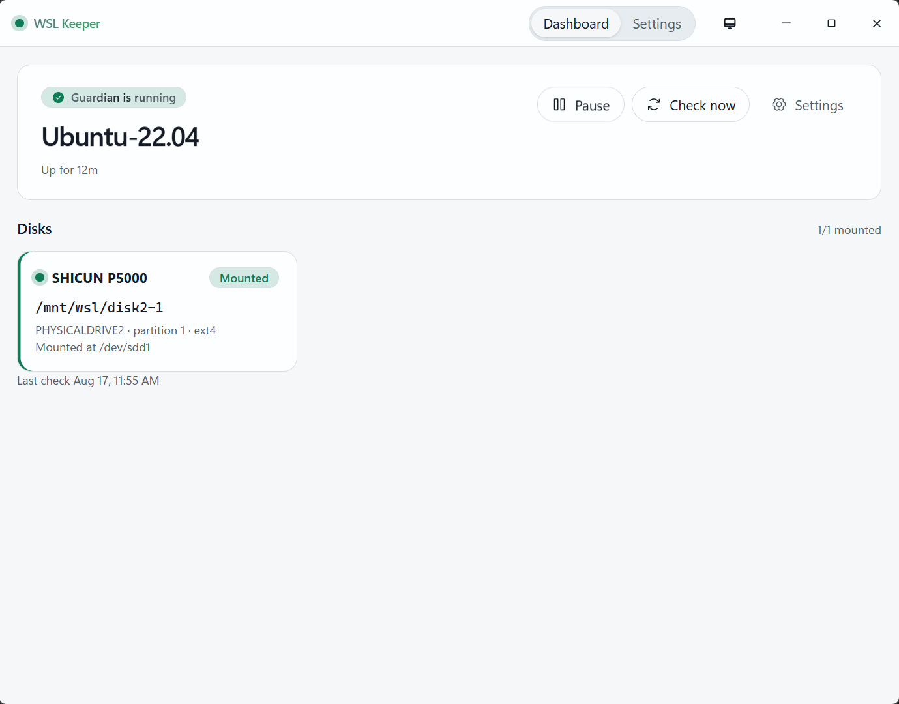

  

<h1 align="center">WSL Keeper</h1>

  <b>English</b> ·
  <a href="docs/zh-CN/README.md">简体中文</a>

  
  

Keeps a WSL distro running. Remounts Linux disks after reboot.

Close the window → tray. Quit from the tray menu.

  

## Install

- Windows 10/11 x64, [WSL](https://learn.microsoft.com/windows/wsl/install) installed
- Disk mount needs **WSL 2**
- [Releases](https://github.com/bb2103/wsl-keeper/releases) → `-setup.exe` (or `.msi`)

## Usage

1. **Settings** → pick a distro → turn the guardian on
2. Optional: a command to run after the distro starts
3. Linux disk (ext4 / xfs / btrfs) → Disks → Guard → auto-mount → accept the one admin prompt  
   Mount point: `/mnt/wsl/<name>`
4. Pause from the dashboard or tray when you don’t want auto-restart
