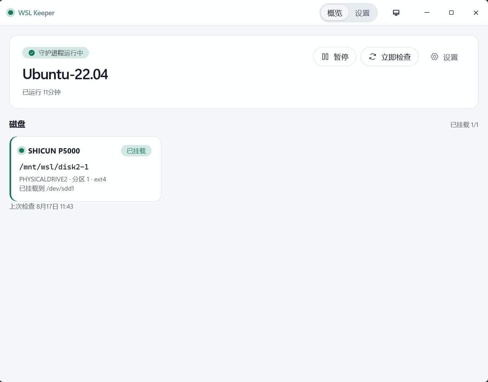

  

<h1 align="center">WSL Keeper</h1>

  <a href="../../README.md">English</a> ·
  <b>简体中文</b>

保持选定的 WSL 发行版在线。重启后把 Linux 物理盘再挂回 WSL。

关窗口 = 进托盘。退出请用托盘菜单。

  

## 安装

- 64 位 Windows 10 / 11，已装 [WSL](https://learn.microsoft.com/windows/wsl/install)
- 挂物理盘需要 **WSL 2**
- [Releases](https://github.com/bb2103/wsl-keeper/releases) 下载 `-setup.exe`（或 `.msi`）

## 使用

1. **设置** → 选发行版 → 打开守护
2. 可选：填一条启动后命令（发行版起来后跑一次）
3. Linux 盘（ext4 / xfs / btrfs）→ 磁盘 → 守护 → 自动挂载 → 第一次同意管理员  
   挂载点：`/mnt/wsl/<名字>`
4. 暂时不想自动拉起：概览或托盘里暂停
